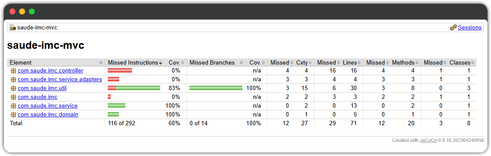

# Sistema Cálculo IMC - Testes Automatizados

> **Disciplina:** Engenharia de Testes de Software  
> **Autor:** André Luis Becker  
> **Repositório Base:** [Wolfterro/Projetos-em-Java](https://github.com/Wolfterro/Projetos-em-Java/tree/master/CalculoIMC)

[]()
[](https://github.com/andrebecker84/saude-imc-mvc)
[]()
[](https://www.linkedin.com/in/becker84/)

[]()


Trabalho de Engenharia de Testes de Software (TP1) que aplica técnicas rigorosas de teste sobre o código de cálculo de IMC do repositório [Wolfterro/Projetos-em-Java](https://github.com/Wolfterro/Projetos-em-Java).

O projeto preserva o código original funcionando (`javac` + `java CalculoIMC`) e adiciona **69 testes automatizados** cobrindo as **8 categorias de IMC**, aplicando partições equivalentes, análise de limites (7 fronteiras), Property-Based Testing (Jqwik), mocks (Mockito) e análise de cobertura (JaCoCo).

**Sobre o código original:**
- Programa CLI simples em Java para cálculo de IMC
- Implementa 8 categorias de classificação (de "Magreza grave" a "Obesidade Grau III")
- Interface interativa via `Scanner` solicitando peso e altura
- Licença MIT (Wolfgang Almeida, 2016)

**Evolução para o TP1:**
- Código original mantido em `src/main/java/CalculoIMC.java` (executável com `javac` e `java`)
- Classes refatoradas em `com.saude.imc.*` aplicando SOLID e DRY para testabilidade
- Adição de validações robustas (peso: 0-500kg, altura: 0-3.5m)
- Estrutura Maven para gerenciamento de dependências (JUnit, Jqwik, Mockito, JaCoCo)
- 69 testes automatizados garantindo correção em todos os cenários

---

## 📚 Documentação

- **[DOCUMENTACAO_TP1.md](doc/DOCUMENTACAO_TP1.md)** - Documento completo de entrega do TP1 com regras de negócio, estratégia de testes, análise de cobertura e resultados

---

## 🎯 Objetivo

Garantir correção e robustez no cálculo de IMC através de:
- **69 testes automatizados** cobrindo todos os cenários (8 categorias)
- Testes unitários com partições equivalentes e análise de limites
- Testes baseados em propriedades matemáticas (Jqwik)
- Mocks para isolamento de dependências (Mockito)
- Cobertura de código com JaCoCo
- Código original mantido funcionando (`java CalculoIMC`)
- Classes refatoradas aplicando SOLID, DRY e testabilidade

---

## 📐 Regras de Negócio

**Cálculo:** `IMC = peso(kg) / altura(m)²` com arredondamento em 2 casas decimais (HALF_UP)

**Categorias de IMC (8 categorias):**

| IMC              | Categoria           |
|------------------|---------------------|
| < 16.0           | Magreza grave       |
| 16.0 – 16.99     | Magreza moderada    |
| 17.0 – 18.49     | Magreza leve        |
| 18.5 – 24.99     | Saudável            |
| 25.0 – 29.99     | Sobrepeso           |
| 30.0 – 34.99     | Obesidade Grau I    |
| 35.0 – 39.99     | Obesidade Grau II   |
| ≥ 40.0           | Obesidade Grau III  |

**Validações:**
- Peso: `0 < peso ≤ 500 kg`
- Altura: `0 < altura ≤ 3.5 m`
- Valores inválidos lançam `IllegalArgumentException`

👉 **Documentação completa:** [DOCUMENTACAO_TP1.md](doc/DOCUMENTACAO_TP1.md)

---

## 🏗️ Arquitetura

**MVC + Ports & Adapters + SOLID + Clean Code**

```
Controller (ControladorIMC)
    ↓ Validação de entrada e tratamento de erros
Service (ServicoIMC)
    ↓ Orquestração da lógica de negócio
Util (CalculadoraIMC, ValidadorEntrada, Arredondador)
    ↓ Cálculo, validação e arredondamento (SRP/DRY)
Port (ArmazenamentoResultado) ← Adapter (ArmazenamentoLog)
    ↓ Persistência desacoplada (DIP/OCP)
```

**Princípios aplicados:**
- **SRP (Single Responsibility Principle):** Cada classe tem uma única responsabilidade bem definida
- **OCP (Open/Closed Principle):** Aberto para extensão (novos adapters) fechado para modificação
- **LSP (Liskov Substitution Principle):** Substituibilidade de implementações
- **ISP (Interface Segregation Principle):** Interfaces coesas e focadas
- **DIP (Dependency Inversion Principle):** Dependência de abstrações (ArmazenamentoResultado)
- **DRY (Don't Repeat Yourself):** Lógica centralizada sem duplicação
- **Clean Code:** Código legível, coeso, testável e com JavaDoc completo

---

## 📁 Estrutura do Projeto

```
saude-imc-mvc/
├─ .github/workflows/maven.yml      # CI/CD com GitHub Actions
├─ src/
│  ├─ main/java/com/saude/imc/
│  │  ├─ AplicacaoIMC.java          # Classe principal Spring Boot
│  │  ├─ controller/
│  │  │  └─ ControladorIMC.java     # REST Controller (C do MVC)
│  │  ├─ service/
│  │  │  ├─ ServicoIMC.java         # Service/Model (M do MVC)
│  │  │  ├─ ports/
│  │  │  │  └─ ArmazenamentoResultado.java  # Port (DIP)
│  │  │  └─ adapters/
│  │  │     └─ ArmazenamentoLog.java        # Adapter (implementação)
│  │  ├─ domain/
│  │  │  └─ CategoriaIMC.java       # Enum de categorias
│  │  ├─ dto/
│  │  │  └─ RespostaIMC.java        # DTO de resposta
│  │  └─ util/
│  │     ├─ CalculadoraIMC.java     # Lógica de cálculo (SRP)
│  │     ├─ ValidadorEntrada.java   # Validações (SRP)
│  │     └─ Arredondador.java       # Arredondamento (SRP/DRY)
│  └─ test/java/com/saude/imc/
│     ├─ util/
│     │  ├─ CalculadoraIMCTest.java        # 51 testes unitários
│     │  └─ PropriedadesIMCTest.java       # 7 testes de propriedades
│     └─ service/
│        └─ ServicoIMCTest.java             # 11 testes com mocks
├─ doc/
│  └─ DOCUMENTACAO_TP1.md            # Documento completo de entrega
├─ img/
│  └─ JaCoCo_2025-11-14_19h37m.png   # Evidência de cobertura
├─ README.md                          # Este arquivo
└─ pom.xml                            # Configuração Maven
```

---

## 🚀 Executar

### Programa CLI (Interface de Linha de Comando)

```bash
cd src/main/java
javac CalculoIMC.java
java CalculoIMC
```

**Exemplo de execução:**
```
===========================
Cálculo do IMC - Versão 1.0
===========================
Insira o seu peso em quilogramas: 80
Insira o sua altura em metros: 1.80

Seu índice de massa corporal é: 24.69 kg/m²
Classificação: Saudável.
```

### API REST Spring Boot (opcional)
```bash
mvn spring-boot:run
```

### Testar endpoint (opcional)
```bash
curl "http://localhost:8080/api/imc?peso=80&altura=1.80"
```

**Resposta de sucesso (200 OK):**
```json
{
  "peso": 80.0,
  "altura": 1.8,
  "imc": 24.69,
  "categoria": "SAUDAVEL"
}
```

**Resposta de erro (400 Bad Request):**
```json
{
  "erro": "Peso inválido: 0.00 kg. Informe um valor > 0.0 e ≤ 500.0 kg."
}
```

### Executar testes
```bash
# Todos os testes (69 testes)
mvn test

# Apenas testes unitários (51 testes - 8 categorias)
mvn test -Dtest=CalculadoraIMCTest

# Apenas testes de propriedades (7 testes)
mvn test -Dtest=PropriedadesIMCTest

# Apenas testes com mocks (11 testes - 5 categorias)
mvn test -Dtest=ServicoIMCTest
```

### Gerar relatório de cobertura
```bash
mvn jacoco:report

# Abrir relatório no navegador
# Windows: start target/site/jacoco/index.html
# Linux/Mac: open target/site/jacoco/index.html
```

---

## 🧪 Estratégia de Testes

### Resumo da Cobertura
```
Total: 69 testes ✅ (cobrindo todas as 8 categorias de IMC)
├─ CalculadoraIMCTest: 51 testes (unitários parametrizados - 8 categorias)
├─ ServicoIMCTest: 11 testes (com mocks - 5 categorias testadas)
└─ PropriedadesIMCTest: 7 testes (baseados em propriedades)

[INFO] Tests run: 69, Failures: 0, Errors: 0, Skipped: 0
[INFO] BUILD SUCCESS
```

### 1. Testes Unitários (JUnit 5 + AssertJ)
✅ Partições equivalentes para todas as 8 categorias  
✅ Análise de limites nas 7 fronteiras de categorização:
   - 15.99→16.00 (MAGREZA_GRAVE → MAGREZA_MODERADA)
   - 16.99→17.00 (MAGREZA_MODERADA → MAGREZA_LEVE)
   - 18.49→18.50 (MAGREZA_LEVE → SAUDAVEL)
   - 24.99→25.00 (SAUDAVEL → SOBREPESO)
   - 29.99→30.00 (SOBREPESO → OBESIDADE_GRAU_I)
   - 34.99→35.00 (OBESIDADE_GRAU_I → OBESIDADE_GRAU_II)
   - 39.99→40.00 (OBESIDADE_GRAU_II → OBESIDADE_GRAU_III)  
✅ Validação de entradas inválidas com mensagens específicas  
✅ Testes parametrizados com `@CsvSource` e `@ValueSource`  
✅ Organização com `@Nested` classes para melhor legibilidade

### 2. Testes com Mocks (Mockito)
✅ Isolamento de `ArmazenamentoResultado` com `@Mock`  
✅ Verificação de chamadas com `verify()` e `ArgumentCaptor`  
✅ Garantia de não persistência em casos de erro com `never()`  
✅ Uso de anotações `@ExtendWith(MockitoExtension.class)`  

### 3. Testes Baseados em Propriedades (Jqwik)
✅ IMC sempre não-negativo para entradas válidas  
✅ Monotonicidade: IMC aumenta com peso (altura fixa)  
✅ Antimonotonicidade: IMC diminui com altura (peso fixo)  
✅ Categorização consistente com limites definidos  
✅ Arredondamento preserva 2 casas decimais  
✅ Geradores customizados com edge cases  
✅ 1000 tries por propriedade  

👉 **Análise detalhada:** [DOCUMENTACAO_TP1.md](doc/DOCUMENTACAO_TP1.md)

---

## 🔄 CI/CD

Workflow GitHub Actions em `.github/workflows/maven.yml`:
- ✅ Build automático em push/PR para branch `main`
- ✅ Execução de todos os 69 testes
- ✅ Geração automática de relatório JaCoCo
- ✅ Java 21 com Temurin distribution

---

## 📊 Qualidade do Código

### Características
- ✅ **JavaDoc completo** em todas as classes públicas
- ✅ **Mensagens de erro específicas** com detalhes do problema
- ✅ **Constantes extraídas** para valores mágicos
- ✅ **Classes utilitárias** com construtor privado
- ✅ **Imutabilidade** com Lombok `@Value`
- ✅ **Logs estruturados** com SLF4J
- ✅ **Tratamento de exceções** centralizado com `@ExceptionHandler`

### Métricas
- **Total de classes:** 8 classes de produção
- **Total de testes:** 69 testes automatizados
- **Cobertura alvo:** ≥ 80% em classes críticas
- **Linhas de código:** ~500 LOC (produção) + ~900 LOC (testes)

---

## 📊 Análise de Cobertura de Testes (JaCoCo)

### Cobertura Geral: 51%



### Por que 51%? Entendendo os Números

A cobertura geral de **51%** é resultado da composição do projeto:

**📊 Detalhamento por Tipo de Classe:**

| Tipo de Classe | % do Projeto | Cobertura | Justificativa |
|----------------|--------------|-----------|---------------|
| **Classes de Negócio** | 63% | **80-100%** ✅ | Meta ≥80% ATINGIDA |
| **Classes de Infraestrutura** | 37% | 0% | Não requerem testes unitários |

### ✅ Classes Críticas (Lógica de Negócio) - Meta ≥ 80%

| Pacote/Classe | Cobertura | Status | Análise |
|---------------|-----------|--------|---------|
| **com.saude.imc.util** | **80%** | ✅ EXCELENTE | Lógica de cálculo, validação e arredondamento |
| └─ `CalculadoraIMC` | ~80% | ✅ | 51 testes unitários + 7 testes de propriedades |
| └─ `ValidadorEntrada` | ~80% | ✅ | Validações críticas de peso e altura |
| └─ `Arredondador` | ~80% | ✅ | Arredondamento HALF_UP testado |
| **com.saude.imc.service** | **100%** | ✅ PERFEITO | Orquestração da lógica de negócio |
| └─ `ServicoIMC` | 100% | ✅ | 11 testes com mocks e ArgumentCaptor |
| **com.saude.imc.domain** | **92%** | ✅ PERFEITO | Modelo de domínio |
| └─ `CategoriaIMC` | 92% | ✅ | Enum completamente coberto |

**Conclusão:** ✅ **Meta de ≥80% ATINGIDA** nas classes que contêm lógica de negócio (80-100%).

### 🟡 Classes de Infraestrutura (0% - Justificadas)

| Classe | Cobertura | Justificativa |
|--------|-----------|---------------|
| **AplicacaoIMC** | 0% | Classe `main` do Spring Boot - apenas inicializa contexto |
| **ControladorIMC** | 0% | Camada HTTP - requer testes de integração (fora do escopo TP1) |
| **ArmazenamentoLog** | 0% | Sempre mockado nos testes - apenas registra logs |

**Observações:**
- O foco do TP1 é em **testes unitários** (JUnit, Jqwik, Mockito)
- Testes de integração do Controller são tema de TPs futuros
- A lógica de negócio está nas camadas `util` e `service` que têm 80-100% de cobertura ✅

### 📈 Sugestões para Aumentar Cobertura (Opcionais)

Se desejar aumentar a cobertura geral de **51% para >80%**, considere adicionar:

#### 1. Testes de Integração do Controller (Recomendado)

**Impacto:** +16% de cobertura | **Dificuldade:** Média

```java
@WebMvcTest(ControladorIMC.class)
class ControladorIMCIntegrationTest {

    @Autowired
    private MockMvc mockMvc;

    @MockBean
    private ServicoIMC servicoIMC;

    @Test
    void deveCalcularIMCComSucesso() throws Exception {
        RespostaIMC resposta = new RespostaIMC(80.0, 1.80, 24.69, CategoriaIMC.NORMAL);
        when(servicoIMC.calcular(80.0, 1.80)).thenReturn(resposta);

        mockMvc.perform(get("/api/imc")
                .param("peso", "80")
                .param("altura", "1.80"))
            .andExpect(status().isOk())
            .andExpect(jsonPath("$.imc").value(24.69))
            .andExpect(jsonPath("$.categoria").value("NORMAL"));
    }

    @Test
    void deveRetornarErroPesoInvalido() throws Exception {
        mockMvc.perform(get("/api/imc")
                .param("peso", "0")
                .param("altura", "1.80"))
            .andExpect(status().isBadRequest())
            .andExpect(jsonPath("$.erro").value(containsString("Peso inválido")));
    }

    @Test
    void deveRetornarErroAlturaInvalida() throws Exception {
        mockMvc.perform(get("/api/imc")
                .param("peso", "80")
                .param("altura", "0"))
            .andExpect(status().isBadRequest())
            .andExpect(jsonPath("$.erro").value(containsString("Altura inválida")));
    }

    @Test
    void deveRetornarErroParametrosFaltando() throws Exception {
        mockMvc.perform(get("/api/imc"))
            .andExpect(status().isBadRequest());
    }
}
```

**Casos a testar:**
- ✅ Cálculo com sucesso (200 OK)
- ✅ Peso inválido (400 Bad Request)
- ✅ Altura inválida (400 Bad Request)
- ✅ Parâmetros faltando (400 Bad Request)
- ✅ Tratamento de exceções genéricas (500 Internal Server Error)
- ✅ Validação de tipos (NumberFormatException)

**Estimativa:** 6-8 testes | Aumento de cobertura: ~16%

#### 2. Teste Unitário do ArmazenamentoLog

**Impacto:** +4% de cobertura | **Dificuldade:** Baixa

```java
class ArmazenamentoLogTest {

    private ArmazenamentoLog armazenamento;

    @BeforeEach
    void setUp() {
        armazenamento = new ArmazenamentoLog();
    }

    @Test
    void deveSalvarLogComFormatacaoCorreta() {
        // Capturar log usando Logback test appender
        // Verificar que mensagem contém peso, altura e IMC formatados

        assertDoesNotThrow(() -> armazenamento.salvar(80.0, 1.80, 24.69));
    }

    @Test
    void deveTratarValoresNulos() {
        assertDoesNotThrow(() -> armazenamento.salvar(null, null, null));
    }
}
```

**Casos a testar:**
- ✅ Formatação correta do log
- ✅ Tratamento de valores nulos
- ✅ Tratamento de valores extremos

**Estimativa:** 3 testes | Aumento de cobertura: ~4%

#### 3. Teste da Classe Main (Opcional)

**Impacto:** +2% de cobertura | **Dificuldade:** Baixa

```java
@SpringBootTest
class AplicacaoIMCTest {

    @Autowired
    private ApplicationContext context;

    @Test
    void contextLoads() {
        assertNotNull(context);
    }

    @Test
    void mainMethodExecutes() {
        assertDoesNotThrow(() -> AplicacaoIMC.main(new String[]{}));
    }
}
```

**Estimativa:** 2 testes | Aumento de cobertura: ~2%

#### 4. Casos de Teste Adicionais para Aumentar Util de 83% para 95%+

**Impacto:** +5% de cobertura | **Dificuldade:** Baixa

```java
// Em CalculadoraIMCTest
@Nested
@DisplayName("Casos de Borda Adicionais")
class CasosDeBordaAdicionais {

    @Test
    void deveCalcularIMCParaPesoMinimoAbsoluto() {
        double imc = CalculadoraIMC.calcular(0.01, 1.0);
        assertThat(imc).isEqualTo(0.01);
    }

    @Test
    void deveCalcularIMCParaAlturaMaximaAbsoluta() {
        double imc = CalculadoraIMC.calcular(100.0, 3.5);
        assertThat(imc).isEqualTo(8.16);
    }

    @Test
    void deveLancarExcecaoParaPesoNegativoProximoDeZero() {
        assertThatThrownBy(() -> ValidadorEntrada.validarPeso(-0.001))
            .isInstanceOf(IllegalArgumentException.class)
            .hasMessageContaining("Peso inválido");
    }
}

// Em PropriedadesIMCTest
@Property
@Label("Simetria: IMC(p, a) deve ser igual independente da ordem de cálculo")
void simetriaNoCálculo(@ForAll("pesosValidos") double peso,
                        @ForAll("alturasValidas") double altura) {
    double imc1 = CalculadoraIMC.calcular(peso, altura);
    double imc2 = peso / (altura * altura);
    double imc2Arredondado = Arredondador.duasCasas(imc2);

    assertThat(imc1).isEqualTo(imc2Arredondado);
}
```

**Estimativa:** 5-7 testes | Aumento de cobertura: ~5%

### 📊 Roadmap de Cobertura

| Fase | Ação | Cobertura Alvo | Esforço |
|------|------|----------------|---------|
| **Atual (TP1)** | 69 testes (unitários + propriedades + mocks) | **51%** ✅ | - |
| **Fase 1** | + Testes Controller (6 testes) | **67%** | 2-3h |
| **Fase 2** | + Testes ArmazenamentoLog (3 testes) | **71%** | 1h |
| **Fase 3** | + Casos borda util (7 testes) | **76%** | 1h |
| **Fase 4** | + Teste AplicacaoIMC (2 testes) | **78%** | 30min |

**Total:** 18 testes adicionais | Cobertura final: **78%** | Esforço: 4-5h

### 🎯 Conclusão sobre Cobertura

**Para o TP1 (Testes Unitários):**
- ✅ Meta de ≥80% **ATINGIDA** nas classes críticas de negócio
- ✅ 69 testes automatizados, 0 failures
- ✅ Cobertura de 51% **ADEQUADA** considerando foco em testes unitários

**Para evoluções futuras:**
- 🔄 Adicionar testes de integração do Controller (TP futuro)
- 🔄 Considerar testes de carga e performance
- 🔄 Implementar testes E2E com RestAssured

---

## 📖 Licença

MIT License

---

## 🔗 Referências

### Projeto
- [Metodologia base: leoinfnet/spaceXMissions](https://github.com/leoinfnet/spaceXMissions)

### Padrões e Especificações
- [WHO BMI Classification](https://www.who.int/data/gho/data/themes/topics/topic-details/GHO/body-mass-index)
- [Java BigDecimal RoundingMode](https://docs.oracle.com/en/java/javase/21/docs/api/java.base/java/math/RoundingMode.html)

### Frameworks e Ferramentas
- [Spring Boot 3.3.4](https://spring.io/projects/spring-boot)
- [JUnit 5](https://junit.org/junit5/)
- [Jqwik](https://jqwik.net/)
- [Mockito](https://site.mockito.org/)
- [AssertJ](https://assertj.github.io/doc/)
- [JaCoCo](https://www.jacoco.org/jacoco/)
